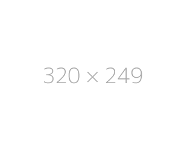

# Trybe Fundamentos

Resumidamento os projetos realizados durante o modulo de Fundamento na escola [trybe](https://www.betrybe.com/), onde foi criada minha base para iniciar na carreira.

<table>
  <tr valign="top">
    <td width="45%" align="center">
      <h2>
        Lessons Learn
      </h2>
      

      
      

      <i>
        Projeto da seção 2 do modulo 1, onde desenvolvi minha primeira página HTML usando CSS. Onde eram testados posicionamentos de elementos para passar os requisitos do projeto, apesar de muitos anos terem passado desde que mexi com HTML, foi minha primeira vez vendo de perto o cypress, testando meu código.
      </i>
    </td>
    <td width="45%" align="center">
      <h2>
        Playground Functions
      </h2>
      

      
      

      <i>
        Projeto da seção 3 do modulo 1, onde iniciei com Javascript, apesar de que estudei no youtube, não seria meu primeiro conteto direto, mas foi basicamente minha primeira vez fazendo um "projeto" onde eram realizados testes automatizados para verificar se a função estava fazendo o que era esperado.
      </i>
    </td>
  </tr>

  <tr valign="top">
    <td width="45%" align="center">
      <h2>
        Pixels Art
      </h2>
      

      
      

      <i>
        Projeto da seção 4 do modulo 1, onde pela primeira vez, criei uma página dinâmica, manipulando o DOM, onde era possível preenchendo com cores quadrados, foi muito mas muito graficante, realizar esse projeto, mesmo que simples, para quem inicialmente nem sabia o que era javascript, conseguir desenhar no navegador, foi incrivel!
      </i>
    </td>
    <td width="45%" align="center">
      <h2>
        Todo List
      </h2>
      

      
      

      <i>
        Projeto da seção 4 do modulo 1, projeto bonus para praticar, onde é possível, criar uma lista de tarefas a fazer, apagar, marcar como realizada, modificar ordem de apresentação na lista, sendo possível salvar no local a lista, para não perder a lista ao atualizar a página.
      </i>
    </td>
  </tr>

  <tr valign="top">
    <td width="45%" align="center">
      <h2>
        Meme Generator
      </h2>
      

      
      

      <i>
        Projeto da seção 4 do modulo 1, projeto bonus para praticar, nesse projeto, é possivel adicionar uma imagem ou usar uma imagem padrão, e adicionar alguma frase para gerar um meme.
      </i>
    </td>
    <td width="45%" align="center">
      <h2>
        Color Guess
      </h2>
      

      
      

      <i>
        Projeto da seção 4 do modulo 1, projeto bonus para praticar, jogo para adivinhar cores, ele apresenta o código decimal do RGB para adivinhar a cor abaixo.
      </i>
    </td>
  </tr>

  <tr valign="top">
    <td width="45%" align="center">
      <h2>
        Mistery Letter
      </h2>
      

      
      

      <i>
        Projeto da seção 4 do modulo 1, projeto bonus para praticar, é contada a quantidade de palavras escritas no input, alterando de forma aleatória sua configuração de fonte de fundo e formatação de letra.
      </i>
    </td>
    <td width="45%" align="center">
      <h2>
        Trybewarts
      </h2>
      

      
      

      <i>
        Projeto da seção 5 do modulo 1, foi meu primeiro projeto dividindo diretamente tarefas com alguém, minha dupla foi a [@alline](https://www.linkedin.com/in/alline-franciely-silva/), onde trocamos ideias e soluções desenvolvemos juntos as soluções de cada requisito!
      </i>
    </td>
  </tr>

  <tr valign="top">
    <td width="45%" align="center">
      <h2>
        Unit Test
      </h2>
      

      
      

      <i>
        Projeto da seção 6 do modulo 1, primeiro contato criando testes automatizados, usando jest, foi bem confuso no começo, mesmo ao final da seção muita coisa que aprendi ao longo do curso só foi fazer sentido mais tarde! Nesse projeto foi mesclado tanto desenvolver alguma função, como criar um teste para um ja existente, e também criar ambos.
      </i>
    </td>
    <td width="45%" align="center">
      <h2>
        Zoo Functions
      </h2>
      

      
      

      <i>
        -
      </i>
    </td>
  </tr>

  <tr valign="top">
    <td width="45%" align="center">
      <h2>
        Car Shop
      </h2>
      

      
      

      <i>
        -
      </i>
    </td>
  </tr>
</table>
