# Trybe Fundamentos

Resumidamento os projetos realizados durante o módulo de Fundamento na escola [trybe](https://www.betrybe.com/), onde foi criada minha base para iniciar na carreira.
Ao clicar na imagem de cada projeto é possivel ver os arquivos criados e um pequeno resumo do projeto.

<table>
  <tr valign="top">
    <td width="45%" align="center">
      <h2>
        Lessons Learned
      </h2>
      <a href="https://github.com/davidrogger/trybe-fundamentos/tree/initial-readme-update/projects_code/01_lessons_learn">
        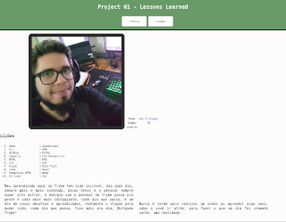
      </a>
    </td>
    <td width="45%" align="center">
      <h2>
        Playground Functions
      </h2>
      <a href="https://github.com/davidrogger/trybe-fundamentos/tree/initial-readme-update/projects_code/02_playground_functions">
        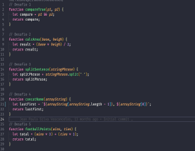
      </a>
    </td>
  </tr>

  <tr valign="top">
    <td width="45%" align="center">
      <h2>
        Pixels Art
      </h2>
      <a href="https://github.com/davidrogger/trybe-fundamentos/tree/initial-readme-update/projects_code/03.1_pixels_art">
        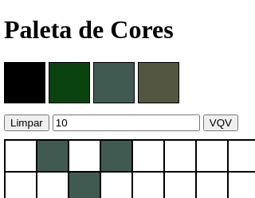
      </a>
    </td>
    <td width="45%" align="center">
      <h2>
        Todo List
      </h2>
      <a href="https://github.com/davidrogger/trybe-fundamentos/tree/initial-readme-update/projects_code/03.2_todo_list">
        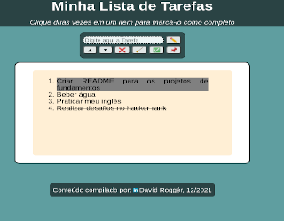
      </a>
    </td>
  </tr>

  <tr valign="top">
    <td width="45%" align="center">
      <h2>
        Meme Generator
      </h2>
      <a href="https://github.com/davidrogger/trybe-fundamentos/tree/initial-readme-update/projects_code/03.3_meme_generetor">
        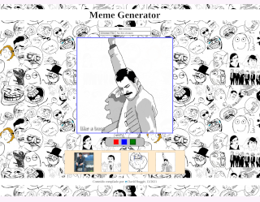
      </a>
    </td>
    <td width="45%" align="center">
      <h2>
        Color Guess
      </h2>
      <a href="https://github.com/davidrogger/trybe-fundamentos/tree/initial-readme-update/projects_code/03.4_color_guess">
        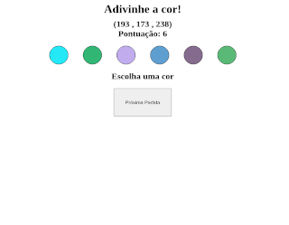
      </a>
    </td>
  </tr>

  <tr valign="top">
    <td width="45%" align="center">
      <h2>
        Mistery Letter
      </h2>
      <a href="https://github.com/davidrogger/trybe-fundamentos/tree/initial-readme-update/projects_code/03.5_mistery_letter">
        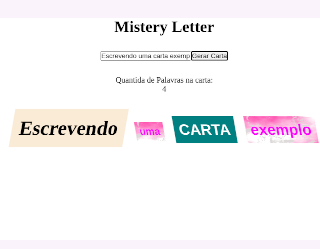
      </a>
    </td>
    <td width="45%" align="center">
      <a href="https://github.com/davidrogger/trybe-fundamentos/tree/initial-readme-update/projects_code/04_trybewarts">
        <h2>
          Trybewarts
        </h2>
        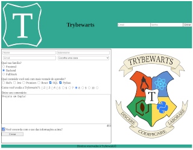
      </a>
    </td>
  </tr>

  <tr valign="top">
    <td width="45%" align="center">
      <h2>
        Unit Test
      </h2>
      <a href="https://github.com/davidrogger/trybe-fundamentos/tree/initial-readme-update/projects_code/05_unit_test">
        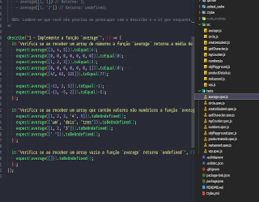
      </a>
    </td>
    <td width="45%" align="center">
      <h2>
        Zoo Functions
      </h2>
      <a href="https://github.com/davidrogger/trybe-fundamentos/tree/initial-readme-update/projects_code/06_zoo_functions">
          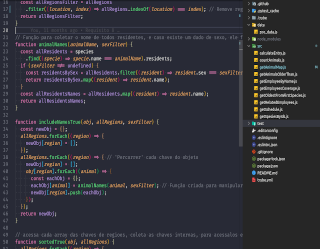
      </a>
    </td>
  </tr>

  <tr valign="top">
    <td width="45%" align="center">
      <h2>
        Shopping Cart
      </h2>
      <a href="https://github.com/davidrogger/trybe-fundamentos/tree/initial-readme-update/projects_code/07_shopping_cart">
        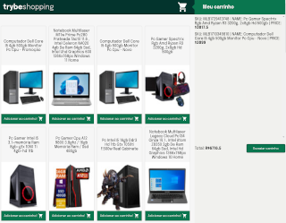
      </a>
    </td>
  </tr>
</table>
